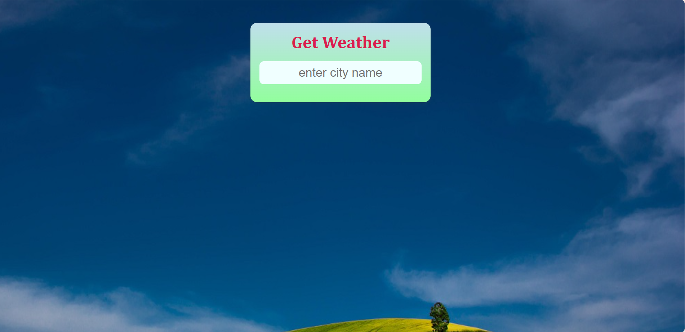
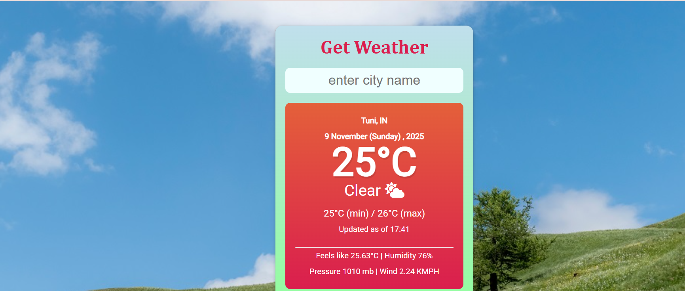

🌦️ Weather App

A beautiful, responsive, and real-time Weather Forecast Application built using HTML, CSS, and JavaScript, powered by the OpenWeatherMap API ☁️

🌈 About the Project

The Weather App allows users to check live weather conditions for any city around the world 🌍.
It features a minimal UI with smooth transitions and weather-based dynamic backgrounds to make the experience more interactive and visually appealing.

✨ Key Features

🌤️ Search weather by city name
🌡️ Shows temperature, humidity, and wind speed
🌎 Displays country and weather condition icons
⚡ Real-time data using OpenWeatherMap API
📱 Fully responsive design for all screen sizes

🧠 Tech Stack
Technology	Purpose
🌐 HTML5	Structure and layout
🎨 CSS3	Styling and animations
⚙️ JavaScript (ES6)	Functionality & API integration
☁️ OpenWeatherMap API	Real-time weather data
🚀 Getting Started

To use or run this project locally 👇

# Clone this repository
git clone https://github.com/DivyaAlla22/Weather-App.git

# Move into the project directory
cd Weather-App

# Open in your browser
open index.html

💡 You can also simply double-click on index.html after downloading the files!

🖼️ Project Screenshots
Home Page

Weather Results

🌐 Live Demo

🔗 Click Here to View Live Project

💫 Project Highlights

✨ Real-time weather info for global locations
✨ Dynamic background changes with weather type
✨ Clean and user-friendly design
✨ Lightweight and fast performance

👩‍💻 Developed by

💖 Divya Alla
🎓 MCA Student | 🌐 Front-End Developer | 💻 Tech Enthusiast

📎 Portfolio: https://divyaalla22.github.io/Portfolio-Website/

💼 LinkedIn: https://www.linkedin.com/in/divya-alla22

🌟 Support

If you liked this project, please consider giving it a ⭐ on GitHub — it motivates me to build more awesome projects! 💪
